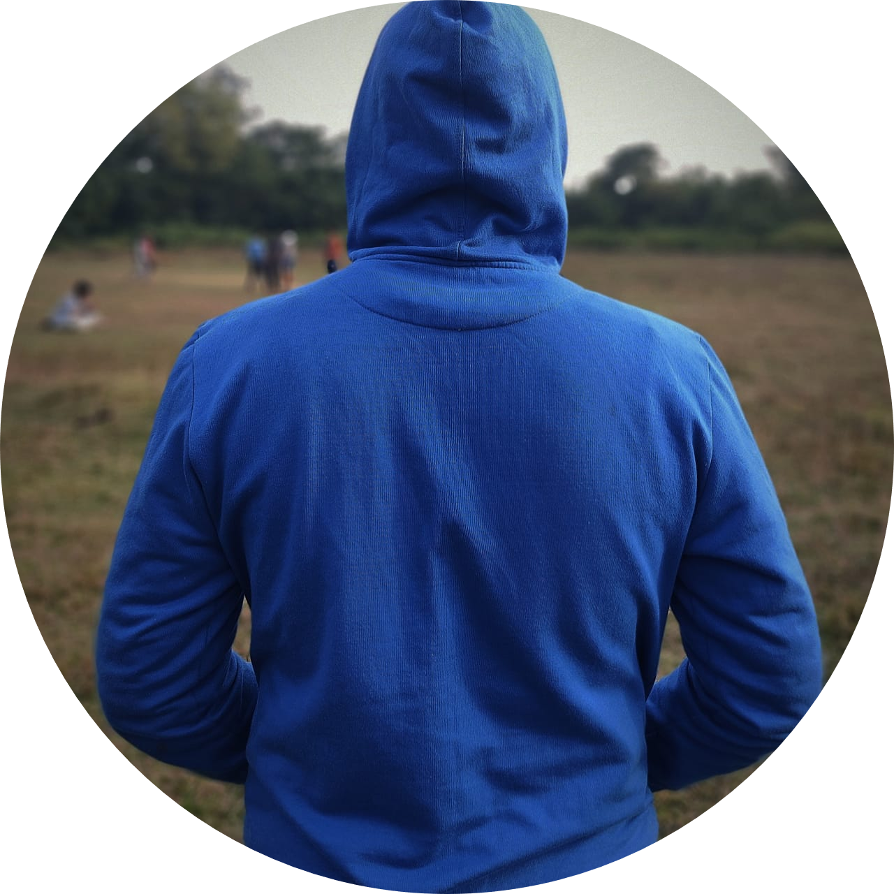

<html lang="en" dir="ltr">
  <head>
    <meta charset="utf-8">
    <title>💩hello dibyendu</title>
    <link rel="stylesheet" href="/style.css">
    <!--  -->
  </head>
  <body >
    <table>
      <tr>
        <td></td>
        <td>
          <h1>💩 Dibyendu Kar</h1>
        

          <em>Student of <strong><a href="https://tat.ac.in/">Trident Academy of Technology</a></strong></em>
        

      </td>
      </tr>
    </table>

     
    

      Rohit Gurunath Sharma (born 30 April 1987) is an Indian international cricketer who plays for Mumbai in domestic cricket and captains
        Mumbai Indians in the Indian Premier League as a right-handed batsman and an occasional
       ight-arm off break bowler.
       He is the vice-captain of the Indian national team in limited-overs formats.
       Outside cricket, Sharma is an active supporter of animal welfare campaigns.
       He is the official Rhino Ambassador for WWF-India and is a member of People for the Ethical
       Treatment of Animals (PETA).
       He has worked with PETA in its campaign to raise awareness of the plight of homeless cats and dogs
       in India.
      
 
    

    <h3>Education :</h3>
    
I have started my early education at <strong><a href="https://www.facebook.com/njkvp">Nayabasan Janakalyan Vidyapith</a></strong>.
       
      after that i came to <strong><a href="https://en.wikipedia.org/wiki/Bhubaneswar">Bhubaneswar</a></strong> and admitted in
      <strong><a href="https://tat.ac.in/">Trident Academy of Technology</a></strong>
    

    <h3>Work Experience :</h3>
    <table>

        <thead>
          <tr>
            <th>Dates</th>
            <th>Works</th>
          </tr>
        </thead>
      <tbody>
        <tr>
          <td>2022-23</td>
          <td>Internship at Security innovation</td>
        </tr>
        <tr>
          <td>2022  </td>
          <td>Leaded the team in Smart India Hackathon</td>
        </tr>
      </tbody>
</table>

<h3>Skills :</h3>
<table>
  <tr>
    <td>Cyber Security :</td>
    <td>⭐⭐⭐⭐</td>
  </tr>
  <tr>
    <td>Web Development :</td>
    <td>⭐⭐⭐⭐</td>
  </tr>
  <tr>
    <td>Android Development :</td>
    <td>⭐⭐⭐</td>
  </tr>
</table>

    <h3>Learning sources :</h3>
    <ul>
      <li><strong><a href="https://google.com">Google</a></strong></li>
      <li><strong><a href="https://youtube.com">Youtube</a></strong></li>
      <li><strong><a href="https://quora.com">Quora</a></strong></li>
      <li><strong><a href="https://Udemy.com">Udemy</a></strong></li>
    </ul>

    <h3>Hobbies :</h3>
    <ol>
      <li>playing cricket</li>
      <li>playing video games</li>
      <li>singing</li>
      <li>riding</li>
    </ol>
     
    

      <button type="submit" name="submit" ><a href="contact.html">contact me</a></button>

  </body>
</html>
